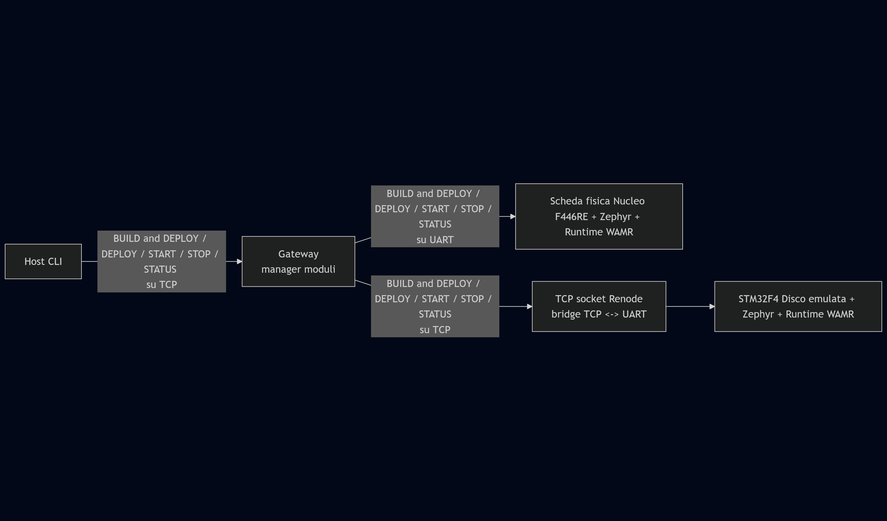
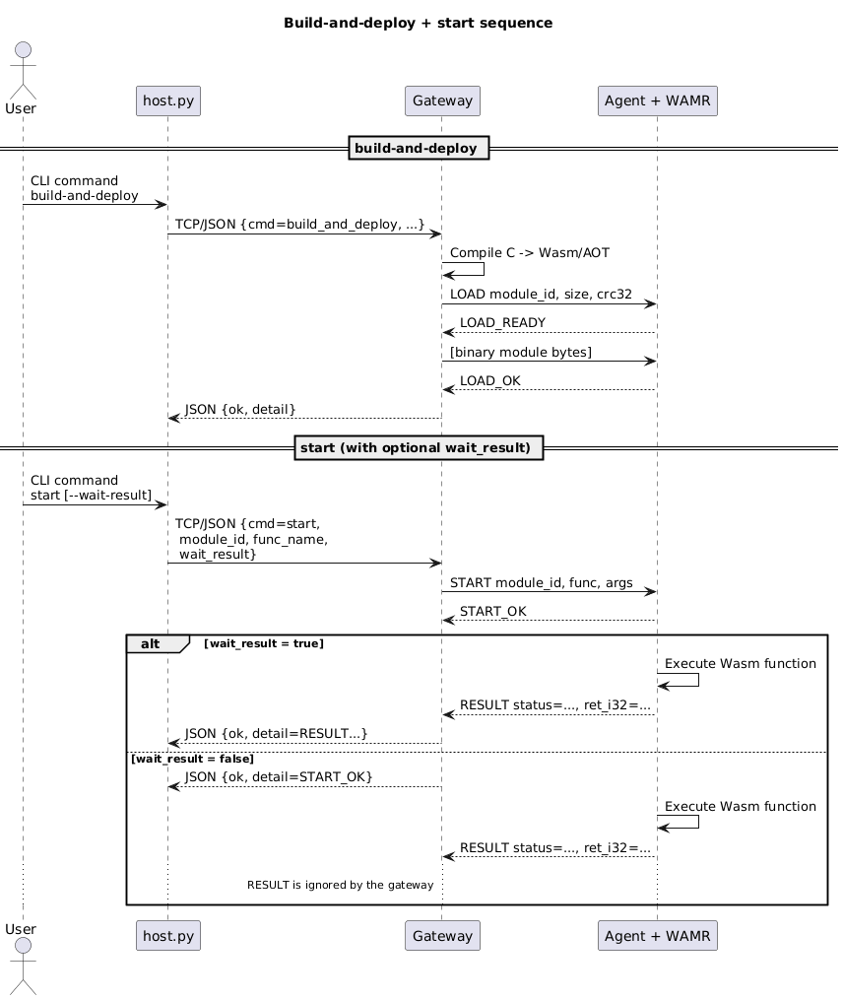

# WebAssembly Orchestration on STM32 + Zephyr

Progetto che consiste nell'orchestrazione di moduli WebAssembly su dispositivi embedded con Zephyr RTOS e WAMR, usando un gateway intermedio e una board fisica + una board emulata. L’obiettivo è costruire un piccolo sistema distribuito con chiara separazione tra control plane (host + gateway) e data plane (device edge).
<br>

## Architettura



- **Host** (`host.py`): fornisce una CLI per inviare comandi di alto livello (`deploy`, `build-and-deploy`, `start`, `stop`, `status`) al gateway. Implementa il ruolo di client del sistema distribuito, e misura il delay end‑to‑end (round‑trip) per ogni operazione.
- **Gateway** (`gateway.py`): è l’orchestrator centrale. Riceve richieste dall’host via TCP/JSON, compila moduli C in WASM/AOT, mantiene la mappatura logica `device → endpoint fisico` e inoltra i comandi al firmware dei device tramite UART o TCP. Incapsula quindi logica di service orchestration, deployment e location transparency rispetto ai nodi edge.
- **Device fisico**: NUCLEO‑F446RE con Zephyr + agent C + runtime WAMR, che esegue i moduli WASM/AOT. L’agent espone un protocollo testuale (`LOAD`, `START`, `STOP`, `STATUS`, `RESULT`) che rappresenta l’interfaccia tra control plane e data plane.
- **Device emulato**: STM32F4‑Discovery in Renode, con lo stesso firmware dell’agent. Renode crea un TCP server che fa da bridge verso `USART2`: i byte ricevuti sul socket TCP vengono inoltrati alla UART emulata e viceversa. In questo modo il gateway usa esattamente lo stesso protocollo e la stessa logica di orchestrazione verso un nodo emulato, ottenendo trasparenza rispetto al tipo di nodo (fisico vs simulato).
<br>

### Protocollo e scambio dati

Il protocollo tra gateway e agent è testuale e basato su linee ASCII, seguito – in caso di `LOAD` – da un payload binario:

- `LOAD module_id=<id> size=<N> crc32=<crc>`  

    Dopo il `LOAD_READY` dell’agent, il gateway invia esattamente N byte consecutivi di modulo (`.wasm` o `.aot`), senza framing aggiuntivo; la frammentazione a livello di UART/TCP è gestita dal firmware, che accumula i chunk finché non ha ricevuto tutti i `size` byte dichiarati.
- `START module_id=<id> func=<nome> [args="a=1,b=2"]`  

    Avvia la funzione esportata; l’agent risponde con `START_OK` e successivamente con `RESULT status=...` (o direttamente con `RESULT` in caso di errore immediato).
- `STOP module_id=<id>`  

    Richiede la terminazione cooperativa di un job long‑running; l’agent risponde con `STOP_OK status=...` ed eventualmente con un `RESULT` finale.
- `STATUS`  

    Ritorna lo stato dell’agent (modulo caricato, runner occupato, funzione corrente, ecc.).

Questa struttura richiama i concetti teorici di remote procedure call (RPC) semplificata (comandi di controllo + valori di ritorno), fault handling (errori come `NO_MODULE`, `BUSY`, `NO_FUNC`) e gestione di job long‑running tramite segnalazione (`STOP` + `status=PENDING` / `RESULT status=STOPPED`).

<br>

## Sequence diagram (es. build-and-deploy + start --wait-result)


<br>

## Struttura della repository

- `firmware/agent/`: codice Zephyr dell’agent (thread COMM + RUNNER) e integrazione WAMR, inclusa l’esposizione di funzioni native verso i moduli WebAssembly.
- `firmware/renode/`: script `.resc` per la STM32F4‑Discovery emulata; configura la macchina Renode, collega `USART2` a una socket TCP e carica il firmware Zephyr.
- `gateway.py`: script Python del gateway (orchestrator), che funge da coordinator tra host e nodi edge.
- `host.py`: script Python del client CLI, che rappresenta il nodo “utente” del sistema distribuito.
- `modules/c/`: sorgenti C dei moduli eseguibili via WAMR (es. `toggle_forever.c`, `math_ops.c`), compilati dal gateway in `.wasm` oppure `.aot`.

Questa organizzazione separa chiaramente i diversi ruoli del sistema distribuito: applicazione utente (host), orchestrator/gateway, nodi edge (firmware), codice applicativo caricato dinamicamente (moduli C/Wasm).

<br>

## Dipendenze principali

- Zephyr SDK e toolchain ARM per costruire il firmware dell’agent.
- Python 3.x con modulo `pyserial` (per usare la porta seriale).
- WAMR e `wamrc` disponibili nel `PATH` per la compilazione AOT (configurati con target compatibile con Cortex‑M4).
- `clang` configurato per generare moduli WebAssembly compatibili con WAMR.

<br>

## Build dei moduli

Build C → wasm:
```
clang --target=wasm32-unknown-unknown -O3 -nostdlib -Wl,--no-entry -Wl,--initial-memory=65536 -Wl,--max-memory=65536 -Wl,--stack-first -Wl,-z,stack-size=2048 toggle_forever.c -o toggle_forever.wasm
```

Build wasm → AOT:
```
wamrc --target=thumbv7em --target-abi=gnu --cpu=cortex-m4 -o toggle_forever.aot toggle_forever.wasm
```

<br>

## Esecuzione rapida

1. **Gateway**  
    Da terminale:
    ```
    python gateway.py --port 9000
    ```

2. **Firmware sui device**
    
    Build del firmware dell'agent per la scheda fisica NUCLEO-F446RE:
    ```
    cd firmware/agent
    west build . -d build_nucleo -b nucleo_f446re --pristine
    ```
    Flash su NUCLEO‑F446RE:
    ```
    west flash --build-dir build_nucleo
    ```
    Build del firmware per la scheda emulata STM32F4‑Discovery:
    ```
    west build . -d build_disco -b stm32f4_disco --pristine
    ```
    Avvio di Renode:
    ```
    cd firmware/renode
    renode
    ```
    Avvio dell'emulazione con lo script "stm32f4_discovery.resc"; lo script crea anche il bridge TCP↔UART2. Dal terminale di renode (monitor):
    ```
    s @stm32f4_discovery.resc
    ```

  
3. **Host (esempi di comandi)**

    Compila C → WASM/AOT e deploy su Nucleo:
    ```
    python host.py --device nucleo build-and-deploy --module-id math_ops --source ..\modules\c\math_ops.c --mode aot
    ```

    Avvia una funzione del modulo:
    ```
    python host.py --device nucleo start --module-id math_ops --func-name add --func-args "a=10,b=15" --wait-result
    ```

    Interroga lo stato dell’agent:
    ```
    python host.py --device nucleo status
    ```

    Ogni comando dell’host stampa anche `e2e_latency_ms`, che rappresenta il tempo end‑to‑end tra l’invio della richiesta dal PC e la ricezione della risposta (includendo host, gateway, rete/seriale e device di destinazione). Questo permette di collegare il POC a concetti di misurazione delle prestazioni in sistemi distribuiti (latenza end‑to‑end, tempi di servizio, overhead di orchestrazione).

